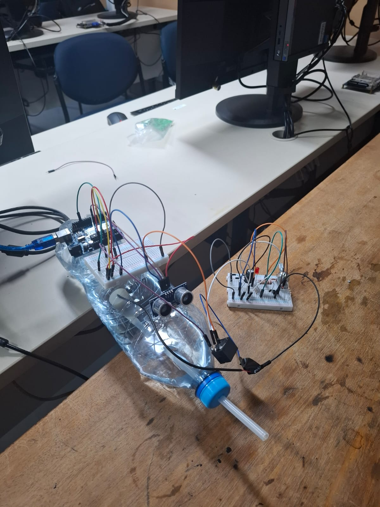

# Arma de Água com Arduino e Sensor de Presença

# Objetivo do projeto

O objetivo do trabalho era utilizar um sensor ultrassônico para detectar a presença de um alvo. A partir disso, realizar o disparo utilizando uma Bomba de Água imersa dentro do recipiente.

 

| Componentes | Quantidade | Valor unitário (R$) |
|:-----|:--------:|------:|
| Fonte de Tensão Ajustável | 1 | Valor Descrito Acima |
| Resistor 2,2K | 1 | 0,07 |
| Transistor NPN | 1 | 2,60 |
| Relé 5V | 1 | 5,7 |
| Diodo | 2 | 0,7 |
| Placa Arduino Uno | 1 | 52,40 |
| Sensor Ultrassom | 1 | 16,00 |
| Bomba de Água 3 a 6V | 1 | 20,00 |

# Projeto

 

# Vídeo do Projeto
https://youtube.com/shorts/WPJaGv6oAQE?feature=share

# Alunos:

Guilherme Pego dos Santos - 15575570
 
Gustavo Vieira Gomes - 16907251
 
Mateus Juares Felipe - 16891602
 
André Luiz Sousa Paião - 16854281
